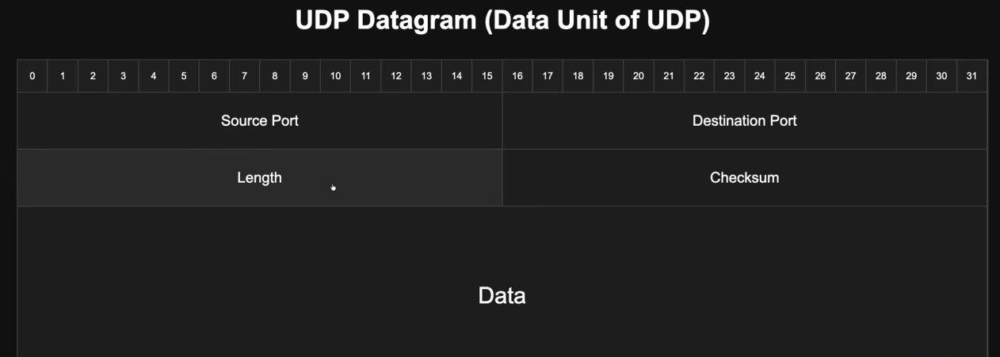

# Content
- [Network](#network)
- []()
- []()
- [MAC Address](#mac-address)
- [ARP](#arp)
- []()
- [OSI](#osi)
- [Routing in Networks](#routing-in-networks)
- [ICMP](#icmp)
- [TCP](#TCP)
- [UDP](#udp)
- []()
- []()
- []()
## Network
- 2 ya 2 se zyada devices jo aapas me communicate kar sakte hain
- Networking ka matlab hi communication hai.
- Agar ye(Laptop,Mobile,Printer etc) ek dusre se baat kar sakte hain ya data bhej sakte hain, to ye same network me hain

```txt
Example 1

Socho tumhare aur dost ke paas walkie-talkie hai
Rahul  <------->  Rahul
Ye ek chhota network hai.


Example 2 - Ghar ka WiFi

           WiFi Router
               |
----------------------------------
|          |          |          |
Laptop    Mobile      TV      Printer


Laptop connect hua.

↓
DHCP bola
↓
Le...
192.168.1.2

Dusra mobile aaya.
↓
DHCP bola
↓
Le...
192.168.1.3

TV aaya.
↓
DHCP bola
↓
Le...
192.168.1.4

```
```txt
192.168.y.x

192.168 = Private IP Range ka part hai.

y = Network ID (Router/Admin configure karta hai)

x = Host ID (DHCP ya Admin assign karta hai) / Host (Device)
```
- Example
```txt
Tumne router setup kiya
Tumne decide kiya:
Network = 192.168.5.x
Ab router ka IP ho sakta hai:
192.168.5.1
Ab DHCP devices ko dega:

Laptop   → 192.168.5.2

Mobile   → 192.168.5.3

TV       → 192.168.5.4

yeh Mobile,TV,etc sab ek Host hai
yeh pure Network ko LAN(Local Area Network)
```


### IP Address
- IP Address ek Logical Address hai
- Jaise Hamare ghar ka address
- Computer ke paas do address hote hain
```txt
MAC Address = Physical Address
- MAC hardware ke andar hota hai

IP Address = Logical Address
- IP software se assign hota hai

```


```txt
192.168.1.10
Octet: har . seperate  to octet
11000000 10101000 00000001 00001010


8 bits each Octet
8 bits means 0-255 values

8*4=32 bits
Isliye IPv4 = 32-bit address


```
### Private vs Public IP
- Private IP = Wo IP jo sirf Local Network (LAN) ke andar valid hota hai
- Public IP = Poore Internet me ek hi device (ya ek Internet connection) ke paas ye Public IP hota hai
- NAT (Network Address Translation): Router Private IP ko Public IP me translate karta hai
- Private IP Ranges
```txt
Ye teen ranges sirf Private Networks ke liye reserve hain:

10.0.0.0
↓
10.255.255.255


172.16.0.0
↓
172.31.255.255


192.168.0.0
↓
192.168.255.255


```


### CIDR (Classless Inter-Domain Routing)
- CIDR Notation (/24, /16, /8) batata hai ki IP Address ki shuru ki kitni bits Network ke liye reserve hain aur kitni bits Host (Devices) ke liye hain
```bash
192.168.1.25
192      .168      .1       .25
8 bits   8 bits    8 bits   8 bits

Total = 32 bits


CIDR /24
192.168.1.25/24
192      .168      .1       .25
Network  Network   Network  Host

CIDR /16
192.168.1.25/16
192      .168      .1       .25
Network  Network   Host     Host


CIDR /8
10.5.20.30/8
10      .5      .20      .30
Network Host    Host     Host


CIDR /32
192.168.1.25/32
Network Network Network Network
Represents only one IP Address
Mostly used in:
                Firewall Rules
                Routing
                Access Control Lists (ACLs)

```
### Subnet
- Subnet Mask bas ye batata hai: IP ka kaunsa hissa Network hai aur kaunsa Host
```txt
IP Address: 192.168.1.25
192.168.1   = Building (Network)

25          = Flat Number (Host)

IP
192.168.1.25

Mask
255.255.255.0

192.168.1 | 25
Network    Host
```
- Subnet Mask bas ye decide karta hai : Network kitna bada hoga
- Ek bade network ko chhote-chhote networks me divide karna.
```txt
IP Address
      AND
Subnet Mask
      ↓
Network Address

//
IP
192.168.1.25

Mask
255.255.255.0

↓

Network
192.168.1.0

//
Network = Devices ka group.
Subnet = Us group ka chhota group.
Subnetting = Bade network ko chhote groups me divide karna.
Subnet Mask/CIDR = Batata hai ki device kis group (subnet) me hai.
Bitwise AND = Computer ka tarika hai ye group (Network Address) nikalne ka.
```

## Default Gateway
```txt
Tumhara ghar = Tumhara computer
Tumhari society = Local Network (LAN)
Society ka main gate = Default Gateway
Bahar ki city = Internet

Agar tum society ke kisi dost ke ghar jana chahte ho (same network), to seedha chale jaoge.

Lekin agar tum mall ya dusri city jana chahte ho (Internet), to pehle society ke main gate se bahar nikalna padega

Ye main gate hi Default Gateway hai

```
- Jab computer ko kisi dusre network me data bhejna hota hai aur usse pata nahi hota ki kahan bhejna hai, to wo data Default Gateway (Router) ko bhej deta hai
- Router fir decide karta hai ki data ko aage kis direction me bhejna hai
- Default Gateway ek Router ka IP address hota hai jo local network se bahar dusre network ya Internet me data bhejne ka rasta provide karta hai

## NIC
- Network Interface Card
- computer ka woh hardware jo computer ko network/internet se jodne aur data bhejne-lene ka kaam karta hai
- network se connect hone ka hardware interface; 
- Ethernet, Wi-Fi aur Bluetooth uske different types/implementations hain

## MAC Address
- MAC address network par kisi particular network interface (NIC) ka unique hardware address/pehchaan hota hai
- MAC (Media Access Control) address ek particular network interface (jaise Ethernet NIC ya Wi-Fi interface) ka Layer 2 address hota hai.
- Ye local network par network interfaces ko identify karne ke liye use hota hai.
### Structure
- MAC address generally `:` ya `-` se `separated hexadecimal `digits ka sequence hota hai.
- Standard MAC address 48 bits = 6 bytes ka hota hai.
- `3C:52:82:AB:91:10`
- Isme 6 groups hote hain.
- Har group 1 byte = 8 bits ka hota hai.
- each seperation having 1 byte
- it having 6 seperation, 6 byte=6*8= 48 bits
- Each byte consist of 2 hexadecimal number
- first 3 bytes ko  OUI (Organizationally Unique Identifier) kaha jata hai
- Last 3 bytes (24 bits) organization ke andar particular interface/device ko identify karne ke liye use kiye ja sakte hain
- MAC address ko commonly hardware address kaha jata hai, lekin modern systems mein MAC address necessarily permanently burned-in hardware identity nahi hota.
- Operating system/software MAC address ko change/spoof/randomize bhi kar sakta hai.
- Isliye MAC ko simply "permanent hardware ID" samajhna technically correct nahi hai.

## ARP
- ARP = Address Resolution Protocol

- ARP ek networking protocol hai jo local network (LAN) mein IP address ko MAC address se map/resolve karne ke liye use hota hai.
### Basic Idea
- Maan lo sender ko target device ka IP address pata hai, but uska MAC address nahi pata.
- Data Ethernet/Wi-Fi network par bhejne ke liye sender ko destination ka MAC address chahiye.
- Yahin par ARP kaam aata hai.
1. Input

- Sender ko target device ka IP address pata hai:

- Target IP = 192.168.1.20

- Lekin target ka MAC address nahi pata.

- 192.168.1.20
      ↓
- MAC address ❓
2. ARP Request

- Sender local network mein ARP Request broadcast karta hai:
```txt
"192.168.1.20 kiski IP hai?
Jiske paas ye IP hai, apna MAC address batao."

Conceptually:

Sender
  │
  │ ARP Request (Broadcast)
  │ "Who has 192.168.1.20?"
  ↓
────────────────────────────
Local Network / LAN
────────────────────────────
  ↓          ↓          ↓
Device A   Device B   Device C
                      ↑
                 IP = 192.168.1.20
```                
3. ARP Reply

- Jis device ke paas requested IP hai, wahi ARP Reply bhejta hai:
```txt
"192.168.1.20 meri IP hai.

Mera MAC:
AA:BB:CC:DD:EE:FF"

Ab sender ke paas mapping aa gayi:

IP Address             MAC Address
192.168.1.20     →     AA:BB:CC:DD:EE:FF
```
4. ARP Cache / Table

- Sender is mapping ko apni ARP cache/table mein temporarily store kar leta hai.
```
ARP Table

192.168.1.20  →  AA:BB:CC:DD:EE:FF
192.168.1.1   →  11:22:33:44:55:66

Isliye next time same device ko data bhejne ke liye har baar ARP Broadcast karne ki zarurat nahi padti.
```

## OSI
- Open System Interconnection

| Layer | Name | Main responsibility | Examples | Data Unit
|---|---|---|---|---|
| 7 | Application | Network services used by applications | HTTP, SMTP, IMAP, POP3, FTP, SSH, DNS | |
| 6 | Presentation | Data representation, transformation, and protection | Character encoding, serialization formats such as JSON, encryption formats | |
| 5 | Session | Establishing, coordinating, and ending communication sessions | Session/dialog control; some RPC/session mechanisms | |
| 4 | Transport | Process-to-process delivery, ports, segmentation, reliability where provided | TCP, UDP; QUIC is commonly discussed around this layer, although it runs over UDP| TCP: segment, UDP: datagram |
| 3 | Network | Logical addressing and routing between networks | IP, ICMP | IP/packet |
| 2 | Data Link | Delivery over a local link, framing, MAC addressing, link-level error detection | Ethernet (IEEE 802.3), Wi-Fi (IEEE 802.11), MAC|Frames |
| 1 | Physical | Transmission of raw bits as physical signals | Copper, fibre, radio waves, electrical/optical signals |


## Routing in Networks
- [src mac| src IP|data| dest ip| dest mac]

## ICMP
- **Internet Control Message Protocol**
- ICMP ek Network Layer protocol hai.
- Hum network me issue/error ko identify krne k liye use krte hai
- Iska use network mein errors ko report karne aur connectivity/diagnostic information provide karne ke liye hota hai
- Jab network mein packet deliver nahi ho pata ya koi issue aata hai, toh ICMP us issue ki information source (sender) tak pahunchane mein help karta hai
- network pe error aata usko source k pass pahochta hai
- Example: ping command ICMP ka use karke check karti hai ki destination host reachable hai ya nahi

### ping
- Ping ek command-line utility hai, jiska use network par kisi doosri machine ki connectivity check karne ke liye hota hai
- Yeh ICMP protocol ka use karke destination ko Echo Request bhejta hai aur reply aane par Echo Reply receive karta hai
- 

#### icmp_seq
```txt
Yeh batata hai ki ping ka kaunsa packet hai

icmp_seq=1
icmp_seq=2
icmp_seq=3
icmp_seq=4

Echo Request packet bhejta hai, Unke corresponding replies mein sequence numbers 1, 2, 3, 4 aaye

icmp_seq=1 → pehle packet ka reply

icmp_seq=2 → doosre packet ka reply

icmp_seq=3 → teesre packet ka reply

Isse aap identify kar sakte hain ki kaunse request packet ka reply aaya

```
#### ttl — Time To Live
- Source se destination tak packet kitne routers (hops) cross kar sakta hai, uski limit hoti hai. Har router par TTL generally 1 se decrease hota hai
- TTL ki initial value source device ka operating system set karta hai. Yeh usually packet bhejte waqt set hoti hai
- Source initial TTL set karta hai, aur har router usse 1 decrease karta hai. Jab TTL 0 ho jata hai, router packet ko discard kar deta hai
- generally wahi router apna IP source address ke roop mein bhejta hai jisne packet ko TTL expire hone ki wajah se discard kiya
- 
#### time — Round-Trip Time (RTT)
- Yeh batata hai ki aapke computer se destination tak request jaane aur reply wapas aane mein kitna time laga

### traceroute
- Traceroute ek networking tool hai jo batata hai ki aapke computer se kisi destination server tak packets kin-kin routers se hokar ja rahe hain
```bash
 traceroute google.com
```
- Networking mein ise mainly network path trace karne, routing samajhne aur connectivity issues debug karne ke liye use kiya jaata hai

## TCP 
- Transmission Control Protocol
- It's 4 Layer (Transport Layer)
- Uses `Port Number` to identify application on a host machine
- it's a connection oriented protocol
- Stateful protocol
- Uses 3 way handshake [ SYN -> SYN-ACK -> ACK]
- Uses a `4 way termination process` ( FIN/ACK) to gracefully close connection
- Data is divided into `Segment` before transmission
- Provides relaible,ordered of data between application
- Receiver sends aknowlegments(ACKs) to confirm recieved data
- Lost segments are detetcted and retransmitted
- Due to being reliable has higher overhead than UDP

### TCP 3-Way Handshake
```txt

Client (192.168.1.5:8000)                                Server (10.0.0.1:80)
[CLOSED]                                                 [LISTEN]
   |                                                        |
   | --- 1. SYN [Seq=1000, Ack=0, Flags=SYN] -------------> |  (SYN_SENT -> SYN_RCVD)
   |                                                        |
   | <--- 2. SYN-ACK [Seq=5000, Ack=1001, Flags=SYN,ACK] --- |  [Combined Packet]
   |                                                        |
   | --- 3. ACK [Seq=1001, Ack=5001, Flags=ACK] ----------> |
   |                                                        |
[ESTABLISHED]                                            [ESTABLISHED]
```


## UDP
- User Datagram Protocol
- It's Layer 4 (`Transport Layer` ) Protocol
- Data Unit is called as `Datagram`
- Ports to address processes in the host
- stateless protocol
- Does not require connection establishment (unlike tcp's 3 way handshake)
- very simple protocol for communication
- Header size of the UDP datagram is only *8 bytes*
-
### UDP Datagram Diagram 


             UDP DATAGRAM (RFC 768)
     0              15 16             31
     +----------------+----------------+
  0  |   Source Port  | Destination Port|
     |    16 bits     |    16 bits     |
     +----------------+----------------+
  4  |     Length     |    Checksum    |
     |    16 bits     |    16 bits     |
     +----------------+----------------+
  8  |                                |
     |                                |
     |           Application          |
     |              Data              |
     |                                |
     +--------------------------------+


- UDP header ka Length field pure UDP datagram ka size batata hai — sirf payload ka nahi
- UDP checksum ka purpose mainly ye verify karna hai ki UDP datagram transmission ke dauran corrupt/change to nahi hua


## Wireshark tool


### Private IP vs Public IP

